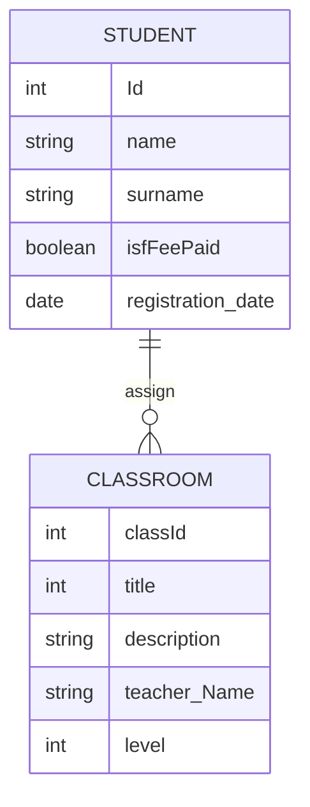

# APP
API Rest para hacer un CRUD de usuarios con Springboot-Boot

# Instalar MySQL
1. Instalamos MySQL `https://dev.mysql.com/downloads/mysql/`
2. Añadir variable a la consola `export PATH=${PATH}:/usr/local/mysql/bin`
3. Conectar `mysql -u root -p` 
4. Crear BBDD `CREATE DATABASE Agente; SHOW databases; USE Agente;`

# Ejecutar Aplicacion
- En Windows `mvnw.cmd spring-boot:run`

- En mac: `./mvnw spring-boot:run`

# Probando la API

## Create Update Usuario 
POST `localhost:8080/usuario`

En el BODY RAW ponemos el usuario para guardar:
```
{
    "nombre": "maria",
    "email": "maria@mail.com",
    "prioridad": 4
}
```

## Leer todos los usuarios
`localhost:8080/usuario`

## Leer usuario por ID
`localhost:8080/usuario/1`

## Leer usuario por prioridad
`localhost:8080/usuario/query?prioridad=4`

# Flujo del código
El controller recibe la peticion web que llama al servicio

El servicio ejecuta la logica de la aplicacion que llama al repositorio

El repositorio hace las conexiones con la bbdd 
que a su vez utiliza el modelo para saber que tipo de información va a traer.

# Librerías 
## Como se inicializa el proyecto vacio como SpringBoot 
Con https://start.spring.io/ añadimos las librerías:
- Project maven
- Language Java
- Packaging War
- Java 11
- Librerías:
 - Spring Data JPA
 - MySQL Driver


# MER 

MySQL contiene una bbdd Colegio que contiene 
estas dos tablas llamadas (student, classroom)



